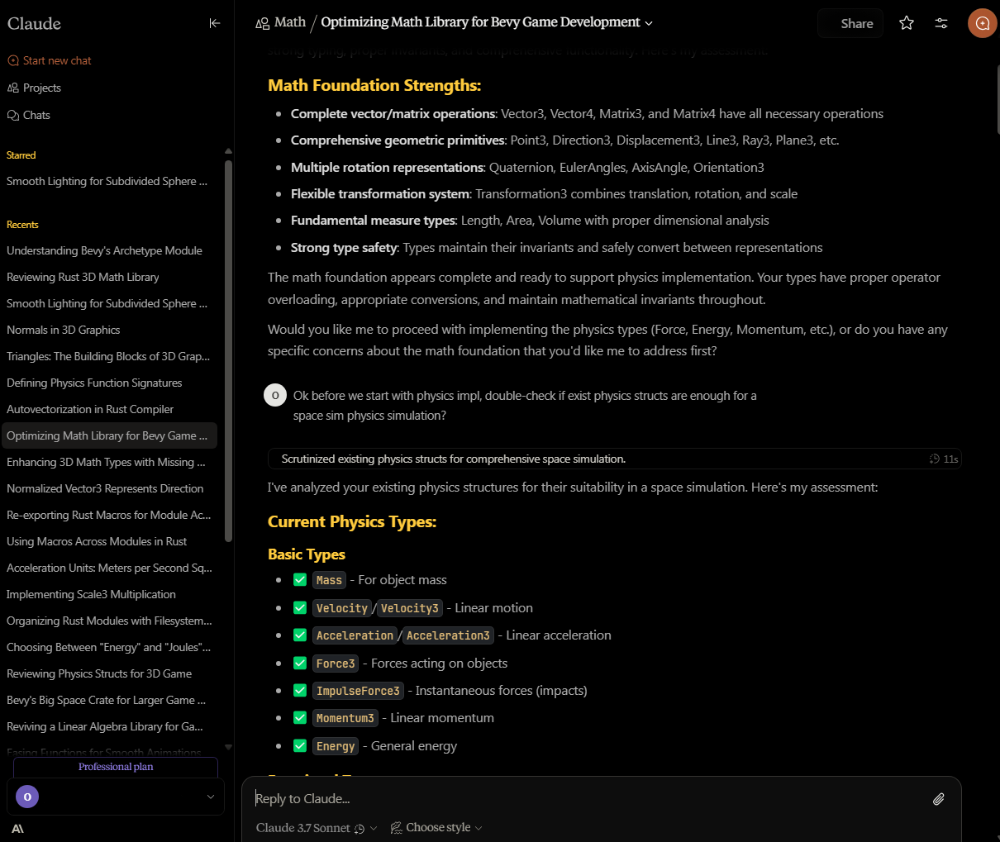

# Custom CSS for the https://claude.ai



# How to use

1. Install Stylus browser addon
2. With Claude opened in the tab, click on browser extensions -> Stylus -> `claude.ai`, that will create an empty style just for that website
3. Fill in the text box with the CSS (see below)

# CSS

```css
body {
  --bg-200: 0 0% 0%;
  --bg-000: 0 0% 5%;
  --text-100: 0 0% 66.67%;
  --codefg: rgb(230, 192, 123);
  --codebg: rgb(20, 19, 16);
  --codefont: "JetBrains Mono", monospace;
  --textfont: "Segoe UI", sans-serif;
  --claude-font-message: var(--textfont);
  --font-styrene-b: var(--textfont);
}

.bg-gradient-to-b {
  background: black;
}

.bg-\[linear-gradient\(to_bottom\2c _hsla\(var\(--bg-000\)\/0\.75\)_0\%\2c _hsla\(var\(--bg-000\)_\/_0\)_90\%\)\] {
  background: black;
}

.before\:bg-\[radial-gradient\(ellipse_at_left_top\2c _hsla\(var\(--bg-000\)\/0\.5\)_0\%\2c _hsla\(var\(--bg-000\)\/0\.3\)_60\%\)\]:before {
  background: black;
  border: none;
}

.max-w-3xl {
  max-width: unset;
}

.px-4 {
  padding: 0;
  padding-left: 1rem;
}

.md\:\[\&\>div\>div\>\:is\(p\2c ul\2c ol\)\]\:pr-8>div>div>:is(p,ul,ol) {
  padding-right: 0;
}

.font-user-message p {
  color: hsl(var(--text-100))
}

strong:not(code strong) {
  color: rgb(220,220,220);
  font-weight: 500;
}

code:not(pre code).text-danger-000, div.ProseMirror>p>code {
  background: var(--codebg);
  color: var(--codefg);
  font-family: var(--codefont);
}

.prismjs.code-block__code, code[class*=language-] {
  background-color: rgb(8, 8, 8);
  background-image: url("data:image/svg+xml,%3Csvg xmlns='http://www.w3.org/2000/svg' viewBox='0 0 500 500'%3E%3Cfilter id='paper-texture'%3E%3CfeTurbulence type='fractalNoise' baseFrequency='0.8' numOctaves='4' seed='1' stitchTiles='stitch' /%3E%3CfeColorMatrix type='matrix' values='0 0 0 0 0 0 0 0 0 0 0 0 0 0 0 0 0 0 0.05 0' /%3E%3CfeTurbulence result='noise2' type='fractalNoise' baseFrequency='0.4' numOctaves='2' seed='5' /%3E%3CfeColorMatrix in='noise2' type='matrix' values='0 0 0 0 0 0 0 0 0 0 0 0 0 0 0 0 0 0 0.03 0' /%3E%3CfeComposite operator='arithmetic' k1='0' k2='1' k3='1' k4='0' /%3E%3CfeColorMatrix type='matrix' values='1 0 0 0 0.01 0 1 0 0 0.01 0 0 1 0 0 0 0 0 1 0' /%3E%3C/filter%3E%3Crect width='100%25' height='100%25' filter='url(%23paper-texture)' fill='%23080808' /%3E%3C/svg%3E");
  background-blend-mode: screen;
  color: #f0f0f0;

}

pre code {
  background: inherit !important;
}

.text-\[0\.9rem\] {
  font-size: 10pt;
}
.prismjs * {
  font-family: var(--codefont);
  font-size: 10pt;
}

h1, h2, h3, h4, h5, h6 {
  color: #ffcb3d !important;
}```
